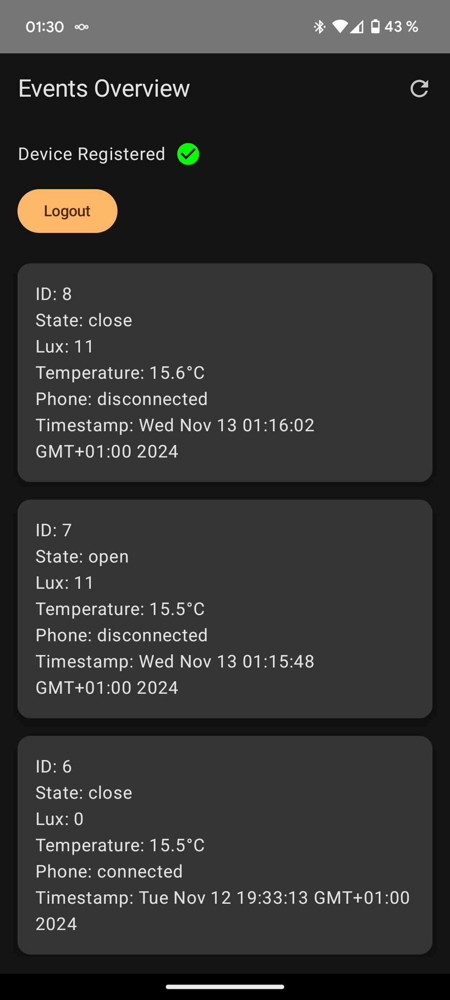
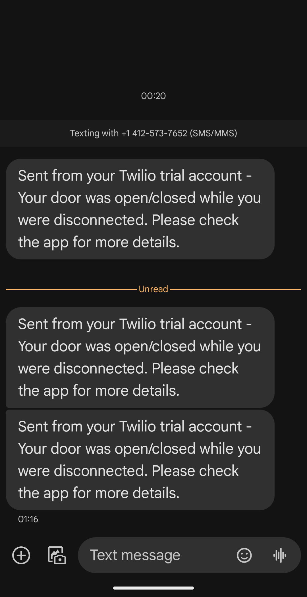

# Theft-Preventer

A quick and simple project to get notifications when someone enters your apartment and you're not there.

| Android App | SMS Notifications |
|:-----------:|:-----------------:|
|  |  |
| Screenshot of the Android App which displays all Events. | SMS Notifications when Door is open/closed without the Phone in the network |


## Overview

Theft-Preventer is a simple home security system that uses a combination of hardware and software to detect unauthorized entry and send notifications. It was created as a fun Sunday evening project and is not intended for serious use.

## How it Works

1. A Shelly Door and Window 2 sensor detects when the door is opened or closed.
2. The sensor sends a GET request to an ESP32 microcontroller.
3. The ESP32 pings your phone on the local network.
4. The ping result is sent to a Rust backend.
5. The backend stores the entry information and sends an SMS via Twilio if your phone is not connected to the network.

## Components

- Shelly Door and Window 2 sensor
- ESP32 microcontroller
- Rust backend server
- Twilio SMS integration
- Android app for checking entries
- Basic Vue.js frontend (minimal styling)

## Setup

### Backend Server

1. Clone the repository on your public backend server:
   ```
   git clone https://github.com/moritzkreemke/theft-preventer.git
   ```

2. Navigate to the project directory:
   ```
   cd theft-preventer
   ```

3. Adjust the `config.toml` and/or `docker-compose.yml` files according to your needs.

4. Start the services using Docker Compose:
   ```
   docker compose up
   ```

   Note: The Docker Compose file creates a volume with user rights 1000. If you encounter permission issues, you may need to change the ownership of the data directory:
   ```
   sudo chown 1000:1000 ./data/
   ```

### ESP32 Configuration

1. Modify the `esp32/main/config.h` file with your specific settings.

2. Flash the modified code to your ESP32 device.

3. ESP32 Endpoints:
    - To register a device for ping checks: `http://<esp32-ip>/register_device`
    - To get configured devices: `http://<esp32-ip>/receive_data`
